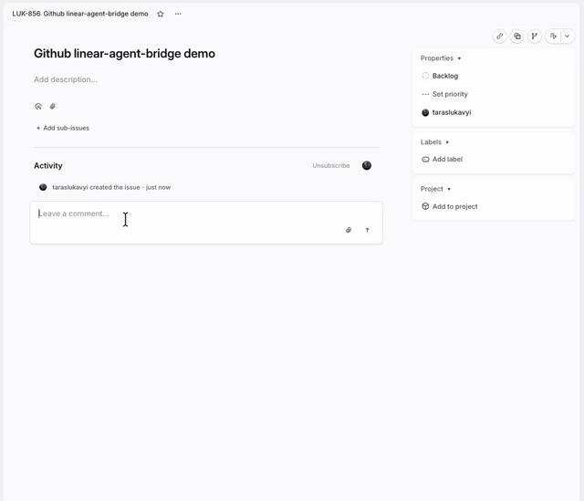

# linear-agent-bridge

[](./media/linear-agent-sessions-demo.mp4)

Full demo video: [`media/linear-agent-sessions-demo.mp4`](./media/linear-agent-sessions-demo.mp4)

A bridge that maps each Linear Agent Session to its own persistent conversation on a backend agent runtime. Two backends are supported behind one `Gateway` abstraction:

- **OpenClaw** — runs as `@Clawd`, the original backend.
- **Hermes** ([NousResearch/hermes-agent](https://github.com/NousResearch/hermes-agent)) — runs as `@Hermes`, talking to the Hermes `api_server`.

One Linear issue can contain many separate Agent Sessions, and each maps to a separate backend session key. That means you can create as many independent agent threads as you want inside the same issue without mixing their context.

The same codebase powers both personas; you pick the backend per deployment with the `BACKEND` env var (`openclaw` | `hermes`). This repo is the bridge runtime itself — it is not a full infrastructure guide for every possible ingress setup.

## Backends

The runtime talks to its backend through a single `Gateway` interface (`src/runtime/gateway-types.ts`). The `BACKEND` env var selects the implementation:

| `BACKEND`  | Persona  | Gateway              | Talks to                                  |
| ---------- | -------- | -------------------- | ----------------------------------------- |
| `openclaw` | `@Clawd` | `OpenClawGateway`    | OpenClaw (plugin host or HTTP gateway)    |
| `hermes`   | `@Hermes`| `HermesGateway`      | Hermes `api_server` (OpenAI-compatible)   |

`BACKEND` defaults to `openclaw` when unset and fails fast on any unknown value. The selector lives in `src/runtime/backend.ts` — the one place to register a new backend's gateway.

Both gateways feed the same universal event mapper (`src/runtime/event-mapper.ts`), so each one produces the same Linear activity shapes (`thought`, `response`, `error`) regardless of which runtime executed the turn.

## Run modes

The bridge runs in one of two modes, sharing the same plugin core:

- **As an OpenClaw plugin** (`index.ts`) — the OpenClaw host supplies the HTTP router, logger, and config, and registers the plugin's routes. Used by the `@Clawd` deployment.
- **As a standalone HTTP server** (`server.ts`, started via `npm start` → `node dist/server.js`) — a minimal Node `http` server provides the same `OpenClawPluginApi` surface (router, console logger, config from env) and runs the plugin's `register()`. Used by the `@Hermes` deployment, which has no OpenClaw to host it. With `BACKEND=hermes` the plugin never touches OpenClaw, so nothing here depends on a local OpenClaw.

## What the bridge does

- Receives Linear Agent Session webhooks on `/plugins/linear/linear`
- Verifies webhook signatures and rejects stale payloads
- Maps one Linear `AgentSession` to one stable backend session key
- Posts a fast visible `thought` activity as an acknowledgement
- Runs one backend turn (OpenClaw or Hermes) for each accepted Linear turn
- Publishes exactly one final visible `response` or `error`
- Uses `AgentSessionEvent` as the canonical trigger for native Linear session runs
- Deduplicates known duplicate webhook combinations
- Supports OAuth callback and code exchange routes for app installation
- Optionally publishes post-run tool/file trace breadcrumbs when `linearDebugToolTrace=true`

## What the bridge does not do

- It does not register `/plugins/linear/api`
- It does not expose `/hooks/linear`
- It does not run a backend-side Linear tool API proxy
- It does not treat Linear as a second tool runtime

Linear is treated as a conversational surface. The selected backend (OpenClaw or Hermes) remains the runtime that actually executes the agent turn.

## Registered routes

Both run modes register the same routes:

- `/plugins/linear/linear`
- `/plugins/linear/oauth/callback`
- `/plugins/linear/oauth/exchange`

The standalone server additionally answers `GET /` and `GET /health` with a small JSON status payload for health checks.

If your public ingress uses a proxy or tunnel, it still needs to forward into the plugin routes.

## Runtime model

The active runtime lives in `src/runtime/*`.

High level flow:

1. Linear sends a webhook to `/plugins/linear/linear`.
2. The bridge validates the signature, normalizes the payload, and returns `202` quickly.
3. The bridge resolves the Linear session identity and maps it to:
   `agent:<agentId>:linear:session:<linearSessionId>`
4. The bridge posts an immediate visible `thought` activity.
5. The bridge runs one backend turn (via the selected `Gateway`) against that stable session key.
6. The bridge publishes exactly one terminal `response` or `error`.

For native Linear agent sessions, `AgentSessionEvent` is the canonical runtime trigger.

Comment webhooks may still be used for bootstrap/fallback lookup in edge cases, but normal comment events tied to an existing native agent session are ignored so one user turn cannot start a second run.

## Session model on normal-human terms

- One Linear `AgentSession` = one isolated backend session.
- One Linear issue can have many separate `AgentSession`s.
- If one Linear comment ends up spawning several `AgentSession`s, each one still gets its own backend session.
- Follow-up turns inside the same Linear `AgentSession` continue the same backend session instead of mixing with the others.

Why this is useful:

- you can run several independent agent conversations inside one issue
- context from one investigation does not bleed into another
- each thread keeps its own memory, tool history, and follow-ups

Minimal diagram:

```text
Linear issue LUK-123

comment A
  -> AgentSession S1
  -> backend session B1

comment B
  -> AgentSession S2
  -> backend session B2
  -> AgentSession S3
  -> backend session B3

follow-up inside S2
  -> continues B2
```

## Infrastructure shape

The bridge only requires a public HTTPS endpoint that ultimately reaches the registered routes. The backend runtime (OpenClaw or Hermes) sits behind the bridge and stays off the public internet.

`@Clawd` (OpenClaw plugin):

```text
Linear
  -> public HTTPS
  -> OpenClaw (hosts the plugin)
  -> /plugins/linear/linear
  -> linear-agent-bridge
```

`@Hermes` (standalone server):

```text
Linear
  -> public HTTPS
  -> linear-agent-bridge (server.ts)
  -> /plugins/linear/linear
  -> Hermes api_server (private network)
```

The two personas are intended to run as two separate deployments of this same codebase, differing only by env (`BACKEND`, OAuth app, webhook secret, backend URL). A standalone front proxy/tunnel is optional — useful for ingress logging or TLS separation, but the bridge does not depend on one.

## Configuration

When running **as an OpenClaw plugin**, the config surface is defined in `openclaw.plugin.json`. When running **as a standalone server**, the same settings are read from environment variables (the server maps env keys onto the plugin config; see `server.ts`).

### Backend selection

- `BACKEND` - `openclaw` (default) or `hermes`

### Hermes backend (`BACKEND=hermes`)

- `HERMES_URL` - base URL of the Hermes `api_server`, e.g. `http://hermes-agent.railway.internal:8642` (required)
- `HERMES_API_KEY` - bearer token; must equal the Hermes service `API_SERVER_KEY` (required)
- `HERMES_MODEL` - OpenAI-compatible model name Hermes expects (optional; has a default)

### OpenClaw backend (`BACKEND=openclaw`)

- `agentId` / `AGENT_ID` - OpenClaw agent id to run, default `main`
- `devAgentId` / `DEV_AGENT_ID` - legacy alias for `agentId`
- `openclawProvider` / `OPENCLAW_PROVIDER` - provider override, default `openai`
- `openclawModel` / `OPENCLAW_MODEL` - model override, default `gpt-5.4`
- `openclawThinking` / `OPENCLAW_THINKING` - thinking override, default `high`

### Linear (both backends)

- `linearWebhookSecret` / `LINEAR_WEBHOOK_SECRET` - required for webhook verification
- `linearApiKey` / `LINEAR_API_KEY` - direct Linear token for GraphQL calls
- `linearOauthClientId` / `LINEAR_OAUTH_CLIENT_ID`
- `linearOauthClientSecret` / `LINEAR_OAUTH_CLIENT_SECRET`
- `linearOauthRedirectUri` / `LINEAR_OAUTH_REDIRECT_URI`
- `linearTokenStorePath` / `LINEAR_TOKEN_STORE_PATH` - persisted OAuth token storage
- `delegateOnCreate` / `DELEGATE_ON_CREATE` - optionally auto-delegate on session create
- `startOnCreate` / `START_ON_CREATE` - optionally move issue to started on session create
- `repoByTeam` / `REPO_BY_TEAM` - workspace hints by Linear team (JSON map in env form)
- `repoByProject` / `REPO_BY_PROJECT` - workspace hints by Linear project (JSON map in env form)
- `defaultDir` / `DEFAULT_DIR` - default workspace hint when no mapping matches
- `externalUrlBase` / `EXTERNAL_URL_BASE` - optional external session link template
- `externalUrlLabel` / `EXTERNAL_URL_LABEL` - label for the external link
- `linearDebugToolTrace` / `LINEAR_DEBUG_TOOL_TRACE` - when true, publish visible tool/file trace breadcrumbs after runs

The standalone server also accepts a `PLUGIN_CONFIG_JSON` blob as a config base (explicit env keys override it), `PORT` (default `8080`), and `LINEAR_DEBUG=1` to enable debug logging.

### Compatibility note

`openclaw.plugin.json` still exposes some legacy compatibility fields so older installs do not fail validation. Those fields should not be treated as the active architecture. In particular, the current runtime does not register `/plugins/linear/api`, even if legacy config fields such as `enableAgentApi`, `apiBaseUrl`, `apiCorsOrigins`, `apiCorsAllowCredentials`, `strictAddressing`, or `mentionHandle` still appear in the schema.

## Tool trace mode

When `linearDebugToolTrace=true` (OpenClaw backend), the bridge fetches recent OpenClaw chat history after a run and publishes compact Linear `thought` activities summarizing tool usage for the current turn.

Examples:

- `read ~/repo/src/runtime/handler.ts`
- `edit ~/repo/src/runtime/handler.ts`
- `web_search "linear duplicate follow-up bug" -> error: 429 rate limited`

This is for debugging and operator visibility. It is intentionally opt-in because it adds noise to Linear activity history.

## Build and test

```bash
npm run build
npm test
```

Compiled output goes to `dist/`. Run the standalone server with `npm start`.

## Local install (OpenClaw plugin)

Typical local extension path:

```bash
~/.openclaw/extensions/linear-agent-bridge/
```

The plugin id remains `linear-agent-bridge`.

## Testing in Linear

1. Enable Linear Agent Session webhooks for your app.
2. Point the public webhook endpoint so it ultimately reaches `/plugins/linear/linear`.
3. Complete OAuth setup if you are using OAuth instead of a direct API token.
4. Mention or delegate the app in a Linear issue.
5. Confirm:
   - a visible `thought` appears quickly
   - only one backend run happens for the turn
   - exactly one final visible `response` or `error` is published
   - follow-up prompts continue the same conversation

## Files that matter

- `index.ts` - plugin entry; registers the live webhook and OAuth routes
- `server.ts` - standalone HTTP server entry (used by the Hermes deployment)
- `src/runtime/backend.ts` - `BACKEND` selector that returns the active `Gateway`
- `src/runtime/gateway-types.ts` - the `Gateway` interface and shared event/result types
- `src/runtime/openclaw-gateway.ts` - OpenClaw `Gateway` implementation
- `src/runtime/hermes-gateway.ts` - Hermes `Gateway` implementation (`api_server`)
- `src/runtime/event-mapper.ts` - maps gateway events to Linear activity payloads
- `src/runtime/handler.ts` - active native Linear runtime and dedupe logic
- `src/runtime/payload.ts` - webhook normalization and trigger extraction
- `src/runtime/prompt.ts` - chat-first prompt shaping
- `src/runtime/gateway.ts` - OpenClaw gateway invocation and history access
- `src/runtime/session-resolver.ts` - session lookup and fallback recovery
- `src/runtime/issue-policy.ts` - issue start/delegate policy on session create
- `src/runtime/skip-filter.ts` - self-authored and system-echo filtering
- `src/runtime/tool-trace.ts` - post-run tool/file trace summarization
- `src/runtime/trace.ts` - correlation-id structured logging across phases
- `src/runtime/redact.ts` - sensitive header/token redaction for logs
- `src/runtime/validation.ts` - webhook signature validation
- `src/linear-client.ts` - Linear GraphQL client
- `src/oauth/*` - OAuth callback, exchange, refresh, and token storage
